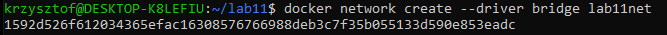
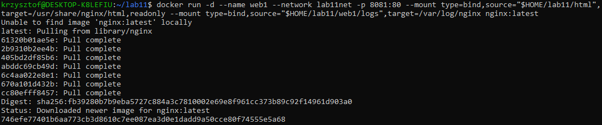
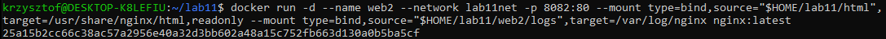
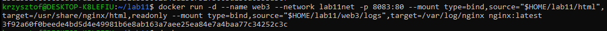
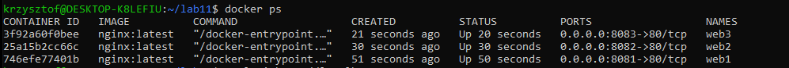
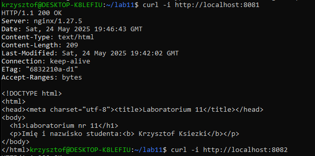
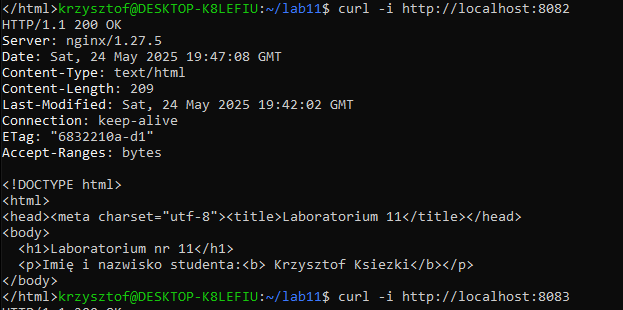
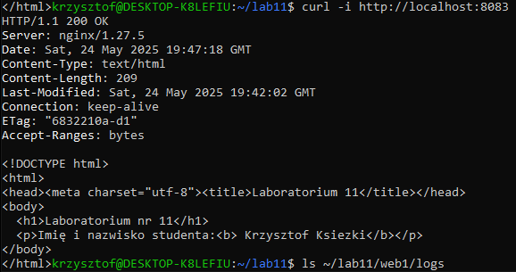
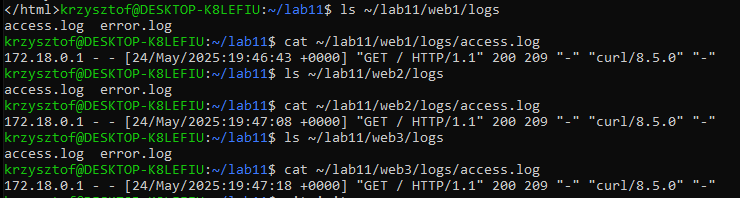

# SPRAWOZDANIE z wykonania zadania z laboratorium 11
## 1. Utworzenie katalogów i pliku HTML

W pierszym kroku utworzony został folder **lab11** a w nim foldery **web1/logs, web2/logs i web3/logs** przeznaczone na zapisanie logów serwerów.
Do folderu lab11 dodany został także katalog **html** z plikiem **index.html** który wyświetla numer laboratorium oraz imie i nazwisko autora.

## 2. Utworzenie sieci mostkowej definiowanej przez użytkownika
Wykorzystane zostało polecenie:
```shell
 docker network create --driver bridge lab11net
```
Wynik działania polecenia:



## 3. Uruchomienie kontenerów
Uruchomione zostały trzy kontenery o nazwach odpowiednio: web1, web2, web3, które zawierają serwery nginx.
Kontener web1:
```shell
docker run -d --name web1 --network lab11net -p 8081:80 --mount type=bind,source="$HOME/lab11/html",target=/usr/share/nginx/html,readonly --mount type=bind,source="$HOME/lab11/web1/logs",target=/var/log/nginx nginx:latest
```
Wynik działania polecenia


Kontener web2:
```shell
docker run -d --name web2 --network lab11net -p 8082:80 --mount type=bind,source="$HOME/lab11/html",target=/usr/share/nginx/html,readonly --mount type=bind,source="$HOME/lab11/web2/logs",target=/var/log/nginx nginx:latest
```
Wynik działania polecenia


Kontener web3:
```shell
docker run -d --name web3 --network lab11net -p 8083:80 --mount type=bind,source="$HOME/lab11/html",target=/usr/share/nginx/html,readonly --mount type=bind,source="$HOME/lab11/web3/logs",target=/var/log/nginx nginx:latest
```
Wynik działania polecenia


### Sprawdzenie działania poleceniem: 
```shell
docker ps
```
Wynik działania polecenia


## 4. Weryfikacja poprawności
Wyświetlenie zawartości index.html z web1:
```shell
curl -i http://localhost:8081
```
Wynik działania polecenia



Wyświetlenie zawartości index.html z web2:
```shell
curl -i http://localhost:8082
```
Wynik działania polecenia



Wyświetlenie zawartości index.html z web3:
```shell
curl -i http://localhost:8083
```
Wynik działania polecenia



### Sprawdzenie logów
Za pomocą polecenia:
```shell
ls ~/lab11/web1/logs
```
Wyświetlona została zawartość katalogu logs serwera web1. Następnie wyświetlona została zawartość pliku access.log poleceniem:
```shell
cat ~/lab11/web1/logs/access.log
```
Czynności te zostały powtórzone dla web2 oraz web3.

Efekt działania


